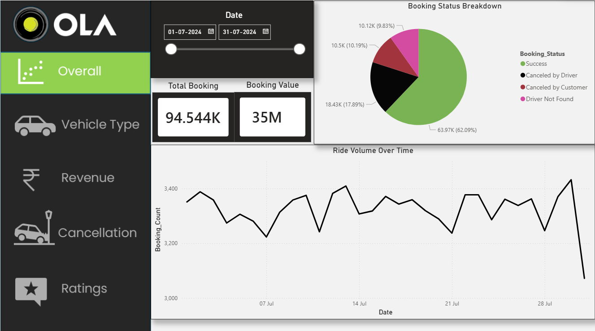
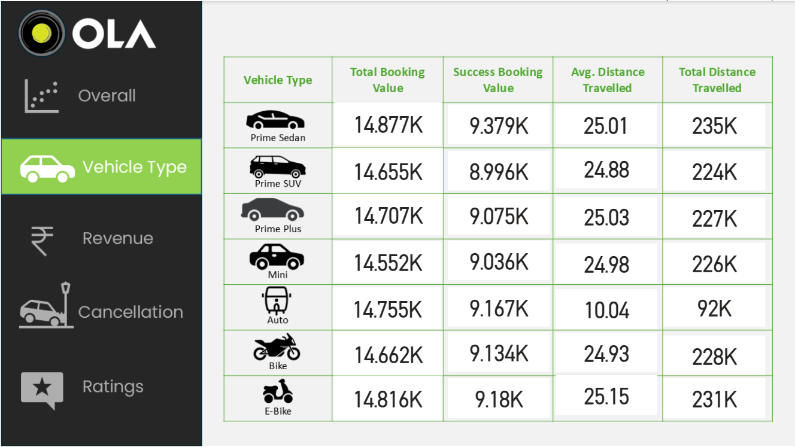
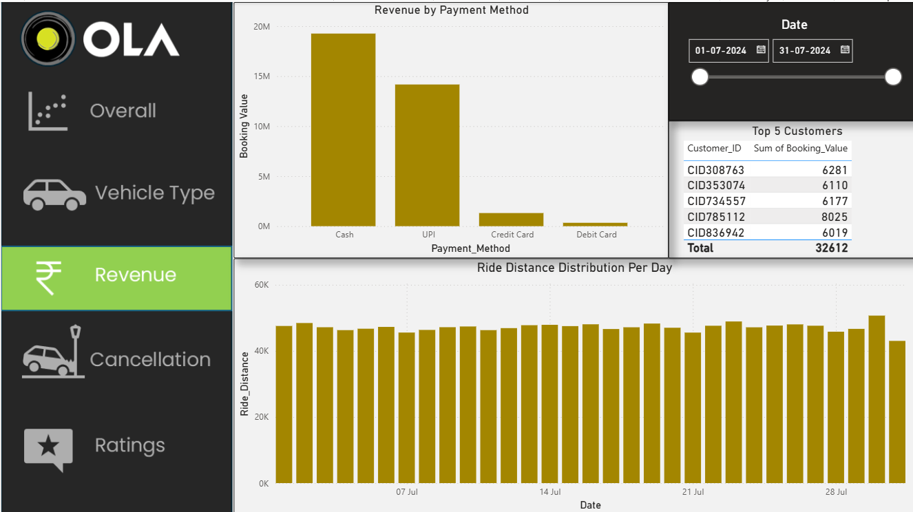
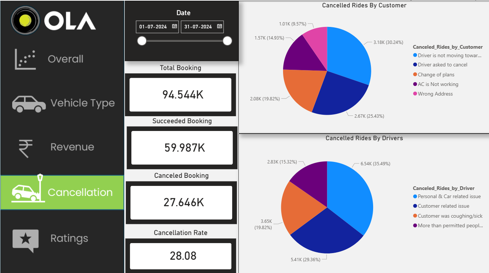

# 🚖 Ola Ride-Hailing Operations Dashboard

A multi-page Power BI dashboard analyzing 10,000+ ride bookings, focusing on operations, revenue, vehicle performance, cancellations, and customer/driver ratings.

---

## 📊 Project Overview

This dashboard provides deep insights into ride-hailing operations, helping identify trends in booking behavior, revenue generation, cancellations, and service quality.

---

## 🧩 Dashboard Features

### 🔹 Multi-Page Navigation
- 5 interactive pages:
  - Overall Dashboard
  - Vehicle Type Analysis
  - Revenue Dashboard
  - Cancellation Analysis
  - Ratings Dashboard
- Cross-page navigation buttons for easy drill-down

---

### 💰 Revenue Analytics
- Tracked:
  - Booking Value
  - Ride Distance
- Analysis by payment methods
- Identified peak demand periods using daily ride trends

---

### 🚗 Vehicle Performance
- 14+ KPI cards per vehicle type
- Compared:
  - Total Booking Value
  - Total Ride Distance
- Enabled performance benchmarking across vehicle categories

---

### ❌ Cancellation Analysis
- Created DAX measure for **Cancellation Percentage**
- Segmented:
  - Customer-initiated cancellations
  - Driver-initiated cancellations
- Identified key cancellation reasons

---

### ⭐ Ratings Dashboard
- Compared:
  - Driver Ratings
  - Customer Ratings
- Analysis across 7 vehicle categories
- Helped identify service quality gaps

---

## 🖼️ Dashboard Preview

### Overall Dashboard

### Vehicle Type Dashboard

### Revenue Dashboard

### Cancellation Dashboard

### Ratings Dashboard

---

## 🛠️ Tools & Technologies

- Power BI
- DAX (Data Analysis Expressions)
- Data Visualization
- Business Intelligence

---

## 🚀 How to Use

1. Download the `.pbix` file
2. Open in Power BI Desktop
3. Use filters and navigation buttons to explore insights

Your Name  
MCA Student | Aspiring Data Analyst / Software Developer
